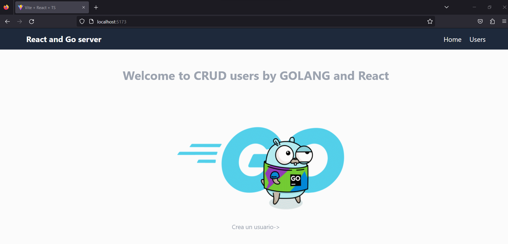
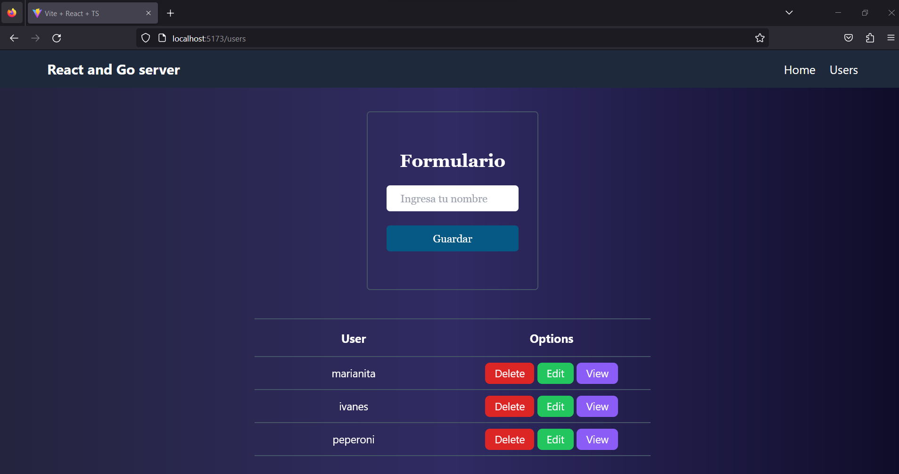
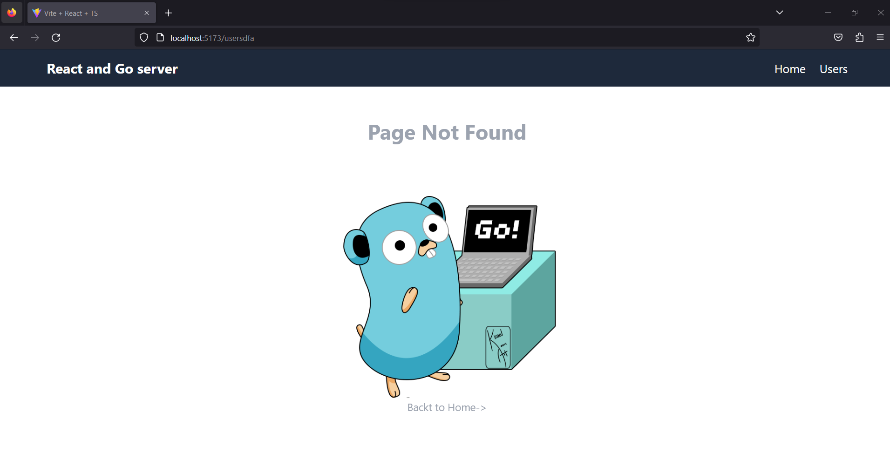

# GOReactMongo

# SERVER

## Iniciamos el proyecto go con el comando

- go mod init ES EQUIVALENTE en node a npm int  sin embargo nos pide ingresar la ruta de su módulo, es decir la direccion de un repositorio donde se va alojar, Si se publica este módulo, debe ser una ruta desde la cual las herramientas de Go puedan permitir descargar su módulo.
```
go mod init github.com/ivanes285/GOReactMongo  
```

### Instalacion de modulos

- Instalamos un framework llamado fiber equivalente(express en nodejs) para trabajar con go
```
go get github.com/gofiber/fiber/v2
```
- Importamos Cors para poder habilitarlos para el frontend
```
 "github.com/gofiber/fiber/v2/middleware/cors"
```
- Para evitar parar el servidor y de nuevo ejecutarlo para aplicar los cambios se instalo el siguiente modulo equivalente (nodemon en nodejs)
 ```
 go install github.com/cosmtrek/air@latest
 ```
 ### Uso del mÓdulo air
 - En la carpeta raiz del server ejecutamos en la terminal el comando
 ```
 air .
 ```
## Ejecución
- Podemos compilar de forma normal con el comando 
```
go run .
```
o tambien
```
 go run .\main.go
```

## Despliegue 
- Desplegamos en railway a travez de un repositorio de github tomando en cuenta que el static file en este caso dist esta al mismo nivel que el main.go
- Para usar statics files en fiber realizamos la siguiente configuracion en el main.go
 ```
  app.Static("/", "./dist") 
 ``` 
- Nota: El server esta al mismo nivel que la folder client que es nuestro frontent. Por lo tanto se asume que la carpeta dist que contiene los archivos estaticos siempre se la traera del frontend. Asi que la configuracion que no me permitió desplegar en railway es la siguiente.
 ```
  app.Static("/", "./client/dist") 
 ```
 - Nota:Por una extraña razon que aun desconozco no lee la url del server como se muestra en la primera linea, sino  que tuve que volver a configurar y establecer el dominio que me dio RailWay y hacer un push como se muestra en la segunda linea 
```
VITE_URLSERVER=http://127.0.0.1:3000/api/v1
```
```
VITE_URLSERVER=https://goreactmongo-production.up.railway.app/api/v1
```
 ## Preview Deploy in Railway
 - Ya que el proyecto esta desplegado en railway podemos acceder a el a travez de la siguiente url
 [Enlace para ver la aplicación](https://goreactmongo-production.up.railway.app/)
 
 ## MOGODB

 - Instalamos paquete para leer una cadena de conexión de MongoDB desde una variable de entorno
 ```
 go get github.com/joho/godotenv
 ```
 
 # CLIENT
 - Usamos vite y typeScript para crear el proyecto frontend 
 - Por alguna razon la configuracion de proxy en el vite.config para establecer la url del server, dio error en el server al momento de comprobar las peticiones http, por lo que se opto por usar una variable de entornor en vite en un archivo .env (tanto para dev como produccion no cambia su valor)  para la url, sin embargo hay que tomar en cuenta que en vite se maneja distinto, incluso desde la declaracion que debe empezar por VITE como se muestra en la primera linea , y se lo llama como se muestra en la segunda linea
 ```
 VITE_URLSERVER=http://localhost:3000/api/v1
 ```
 ```
  await axios.post(import.meta.env.VITE_URLSERVER+"/users"); 
 ```
 
 ## Ejecución
 - Una vez que descargues el proyecto te colocas en la carpeta server , dentro de esta carpeta ejecutas el siguiente comando que lee los cambios y reinicia el servidor el segundo comando tambien ejecuta el servidor pero no lo reiniciará solo.
 ```
 air . 
 ```
 ```
 go run . 
 ```
 
 # Detalles de la aplicacion 
 
 ## Backend (server)
Aplicacion escrita en go , con conexcion a mongo db
### Tecnologías

- [x] GO
- [x] Fiber framework de Go
- [x] MongoDB


### Variables de Entorno (server)
Despues de clonar el proyecto debemos crear un archivo .env  en donde definiremos las siguientes variables de entorno 
- PORT= 3000
- MONGODB_URI=

## Frontend

### Tecnologías

- [x] Aplicacion con vite
- [x] TypeScript
- [x] React js
- [x] Node
- [x] pnpm 
- [x] Tailwind

### Variables de Entorno
Despues de clonar el proyecto debemos crear un archivo .env  en donde definiremos las siguientes variables de entorno 
- VITE_URLSERVER= 

 ### Preview


<p align="center">
    
<p/>


<p align="center">
    
<p/>

<p align="center">
    
<p/>


 
 
 
 
